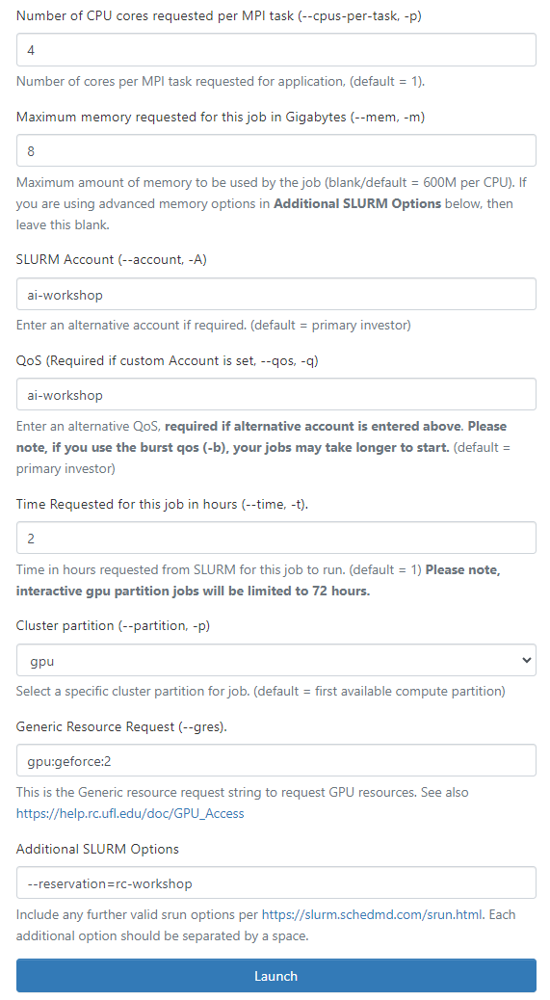

# Distributed Data Parallel Training with Multi-GPU on HiPerGator-AI

- Yunchao Yang
- UF Research Computing

The series starts with a non-distributed script that runs on a single GPU and incrementally updates to end with multinode training on a Slurm cluster.
Code is forked and adapted for the DDP tutorial series at https://pytorch.org/tutorials/beginner/ddp_series_intro.html


# How to use this Repo.

## Step 0: navigate to [ood.rc.ufl.edu](ood.rc.ufl.edu) and request a jupyter notebook with 1 node and 2 GPUs:  
  - Number of CPUs = 4
  - Maximum memory = 8
  - SLURM Account = `ai-workshop`
  - QoS = `ai-workshop`
  - Cluster partition = `gpu`
  - Generic Resource Request = `gpu:geforece:2`
  - Additional SLURM Options = `--reservation=rc-workshop` (only used during the workshop period)



## Step 1: Get started with the starter code
* [single_gpu.py](single_gpu.py): Non-distributed training script on a single GPU
* [How to run]:

```bash
module load pytorch/1.10
python single_gpu.py 50 10` 
```

## Step 2
### Exercise 2.1: adapt your serial code to single node multiple processes run with `mp.spawn` utility and user-specified setting. 
* [exercise1_multigpu.py](exercise1_multigpu.py): DDP on a single node, with `mp.spawn`  
* [exercise1_run_multigpu.sh](exercise1_run_multigpu.sh): runner code

You can test your code by run `./exercise1_run_multigpu.sh`

### Exercise 2.2: adapt your serial code to single node multiple processes using the `torchrun` utility
* [exercise2_multigpu_torchrun.py](exercise2_multigpu_torchrun.py): DDP setup on a single node using `torchrun`
* [exercise2_run_multigpu_torchrun.sh](exercise2_run_multigpu_torchrun.sh): runner

You can test your code by run `./exercise2_run_multigpu_torchrun.sh`

## Step 3. Run MultiNode parallel jobs using SLURM  on HPG (work offline)
* [slurm-moltinode/multigpu_torchrun.py](slurm-moltinode/multigpu_torchrun.py): training script for multiGPU
* [slurm-moltinode/launch_ddp_2N4G.sh](slurm-moltinode/launch_ddp_2N4G.sh): Sample slurm script to launch a trining script using torchrun on 2 Nodes with 2 GPUs on each node.
* [slurm-moltinode/launch_ddp_4N4G.sh](slurm-moltinode/launch_ddp_4N4G.sh): Sample slurm script to launch a trining script using torchrun on 4 Nodes with 1 GPUs on each node.

You can submit your SLURM job script by run `sbatch launch_ddp_2N4G.sh`

## Solutions
You can find the solution to exercises in this folder.

## Learn more about the detailed code walkthrough
Please follow the [Distributed Data Parallel in PyTorch Tutorial Series](https://www.youtube.com/playlist?list=PL_lsbAsL_o2CSuhUhJIiW0IkdT5C2wGWj).


# License
MIT 